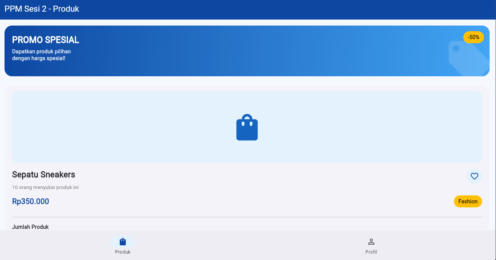
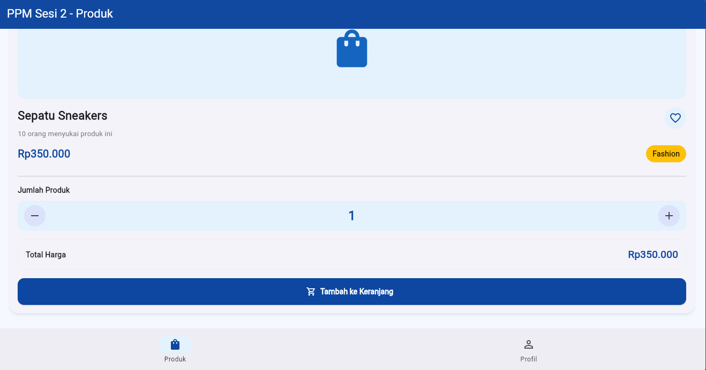
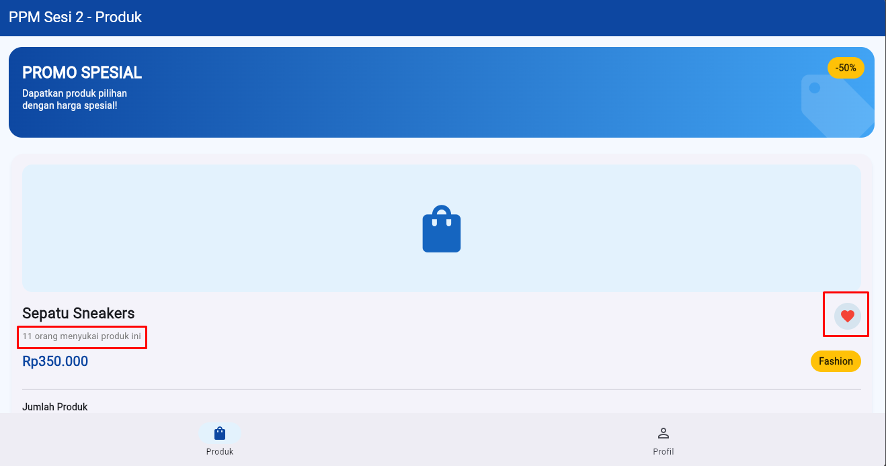
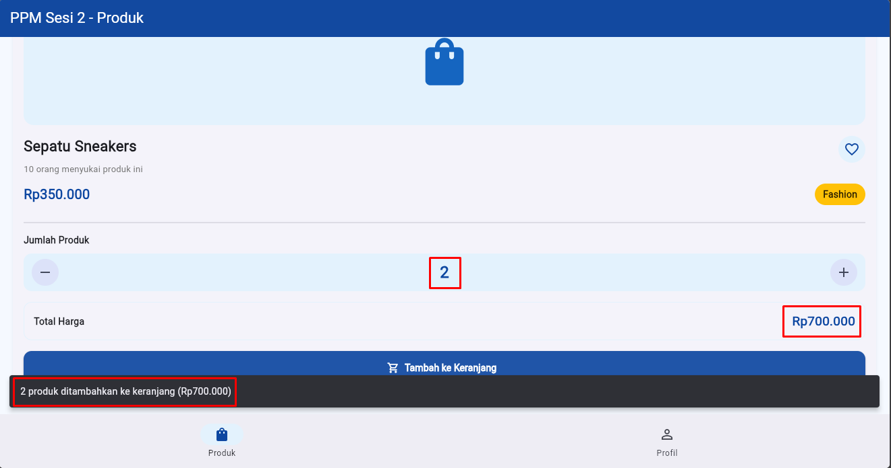
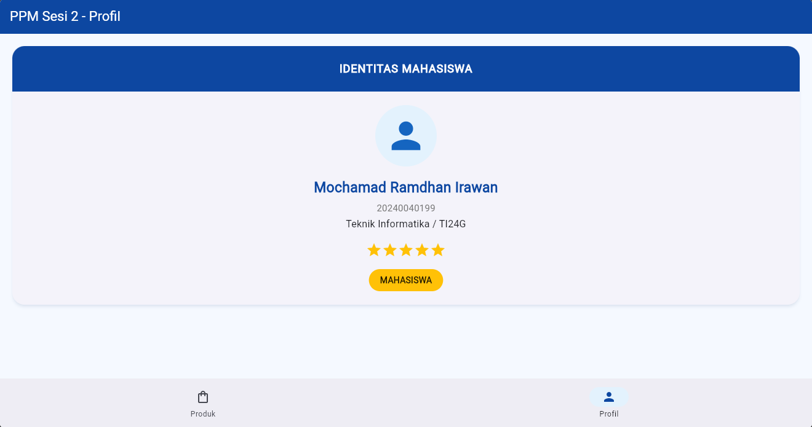

# PPM Sesi 2 - Flutter Widget

## Identitas

- **Nama:** Mochamad Ramdhan Irawan
- **NIM:** 20240040199
- **Prodi/Kelas:** Teknik Informatika / TI24G

---
## Halaman Utama

  

  

---
## Like diklik

  

<h3> Icon Love yang sebelumnya tidak berwarna menjadi warna merah, dan informasi like bertambah </h3>

---
## Tambah Keranjang

  

<h3> Ketika tombol "+" diklik maka angka akan bertambah dan total harga juga bertambah, ketka tambah ke keranjang di klik akan muncul notifikasi produk ditambahkan </h3>

---
## Halaman Profile

  

